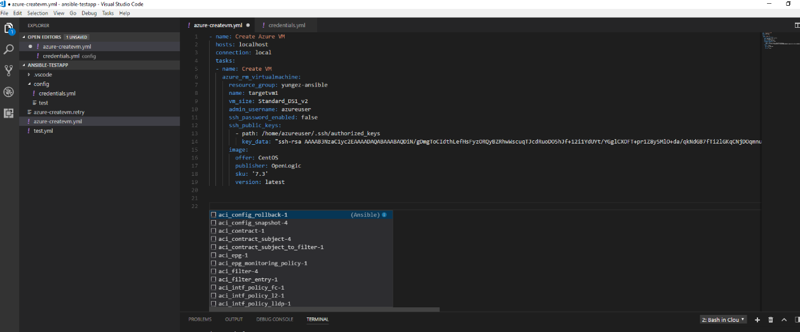

# Visual Studio Code extension for Ansible
Authoring [ansible](https://www.ansible.com) playbook efficiently, run ansible playbook.

## Features

- Authoring ansible playbook efficiently
  - Code snippets. Press `Ctrl + Space`, ansible playbook code snippet will show up.
  - Syntax highlighting.

- Run ansible from Visual Studio Code
  - On Windows, run ansible inside docker
  - On Non-windows platform, provide option to run ansible from docker or from local ansible installation.

## Requirements

|platform|prerequisite|
|--------|-----------|
|Windows|docker|

## Usage
- Code snippets
   Press `Ctrl + Space` in playbook yml file, you'll see ansible modules code snippets.
   

- Run ansible playbook commands
   Press `F1`, type `ansible` in command platte, you'll see two ansible commands: *Run Ansible Playbook in Terminal* and *Run Ansible Playbook in CloudShell*.
  
  - Run Ansible Playbook in Terminal
    1. Input playbook file full path, or use default one.
    2. Set cloud provider credentials in credential yaml file, default path is $HOME/.vscode/ansible-credential.yml, or change credential file path by settings item `ansible.credentialsFile`.
    3. On Non-Windows platform, choose option `docker` or `local`.

  - Run Ansible Playbook in CloudShell
    1. Install [Azure Account](https://marketplace.visualstudio.com/items?itemName=ms-vscode.azure-account) VSCode extension, which is used for Azure login.
    2. Input playbook file full path, or use default one.
    3. Confirm acknowledge on Azure usage fee.
    4. Azure login.

- Configuration
   This extension provide 2 configurations in settings.json.
   - ansible.credentialsFile
      This configuration is used to specify ansible credentials file path. Default is $HOME/.vscode/ansible-credential.yml.
   - ansible.termininalInitCommand
      This configuration is used to specify customized terminal init command. Default is docker run commands for docker, and 'ansible-playbook' for local setup.
    
  
  

## Feedback and Questions
You can submit bug or feature suggestion via [issues](https://github.com/VSChina/vscode-ansible/issues/new).

## License
[MIT license](./LICENSE.md).

## Telemetry
This extension collects telemetry data to help improve our products. Please read [Microsoft privacy statement](https://privacy.microsoft.com/en-us/privacystatement) to learn more.

